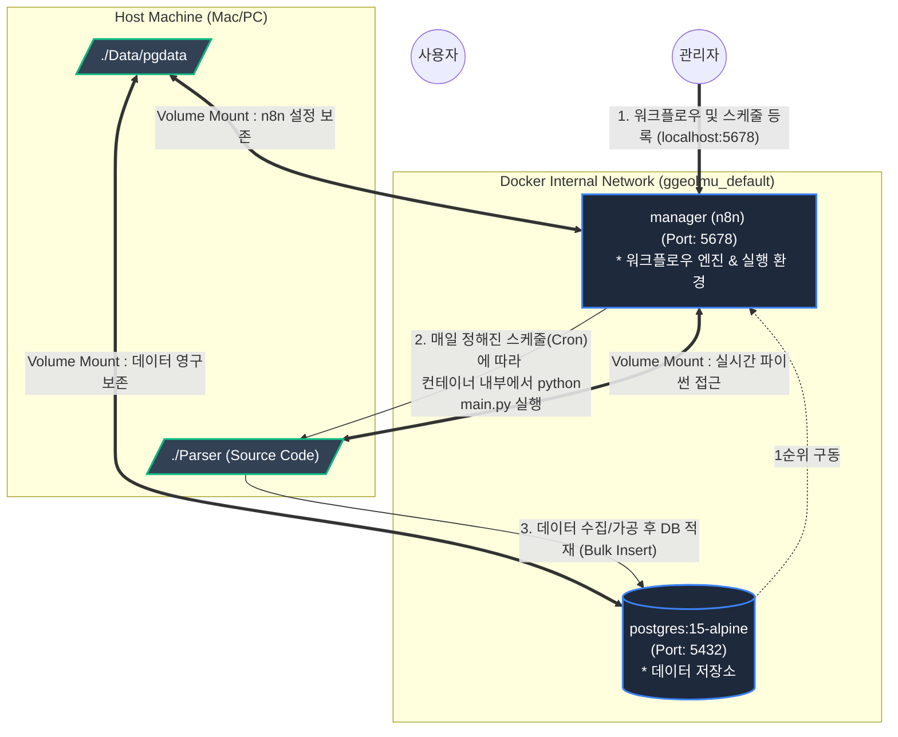
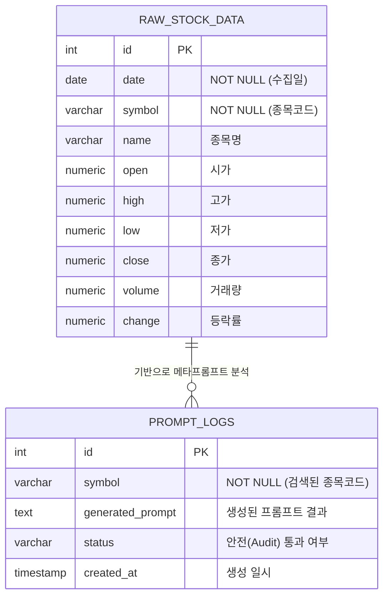

# 🏗️ Docker Compose 아키텍처 다이어그램

`docker compose up -d --build` 명령어를 실행했을 때, 3개의 컨테이너(WEB, WAS, DB)가 어떠한 순서와 의존성을 가지고 실행되는지, 그리고 실제 시스템 내에서 데이터 흐름이 어떻게 동작하는지 보여주는 아키텍처 다이어그램입니다.

### 💡 작동 흐름 설명

1. **빌드 및 복사 (`--build`)**:
   - `Dockerfile.web`과 `Dockerfile.was`를 기반으로 이미지를 새로 굽습니다.
   - 이때 호스트에 있는 `Parser` 안의 파이썬 코드와 정적 HTML/CSS 파일들이 컨테이너 내부로 복사(COPY)됩니다.
2. **실행 순서 (`depends_on`)**:
   - 가장 먼저 `postgres` (DB) 컨테이너가 켜집니다.
   - DB가 준비되면, `was` (백엔드) 컨테이너가 켜지면서 DB_HOST 환경 변수를 통해 DB와 연결을 맺습니다.
   - 마지막으로 `web` (프론트엔드 Nginx) 컨테이너가 켜집니다.
3. **볼륨 매핑 (`volumes`)**:
   - 컨테이너 내부의 데이터베이스 정보는 휘발되지 않도록 호스트 컴퓨터의 `./Data/pgdata` 폴더와 영구적으로 동기화(Mount)됩니다.
4. **접속**:
   - 이제 사용자는 `http://localhost:3000`을 통해 안전하게 프론트엔드에 접속하고, 프론트엔드는 내부적으로 `8000`번 포트의 WAS와 통신하게 됩니다!

---

## 🗄️ 개체 관계도 (ER Diagram)

현재 PostgreSQL에 구축되는 핵심 테이블 구조 및 논리적 연관성입니다. 수집된 원시 데이터와 에이전트가 생성한 프롬프트 로그가 어떻게 관리되는지 보여줍니다.

### 💡 데이터 테이블 설명
- **`RAW_STOCK_DATA`**: `main.py`의 Dask 기반 수집기가 매일 시장 마감 후 원시 주가 데이터를 UPSERT(Date+Symbol 충돌 시 업데이트) 방식으로 쌓는 테이블입니다. 
- **`PROMPT_LOGS`**: 사용자가 웹(WEB)에서 종목을 검색했을 때, 에이전트(AuditAgent & PromptMakerAgent)가 동작한 이력과 생성된 최종 프롬프트 문구를 저장하는 로그 테이블입니다. 두 테이블은 논리적으로 `symbol`(종목코드) 필드를 통해 연결됩니다.
