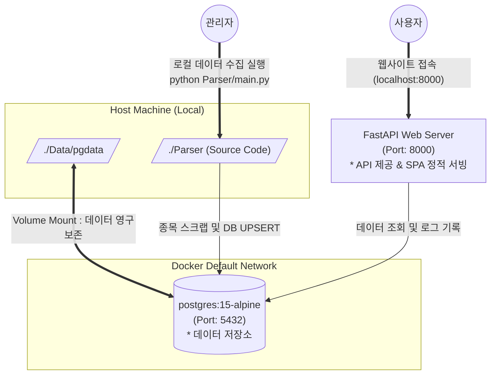
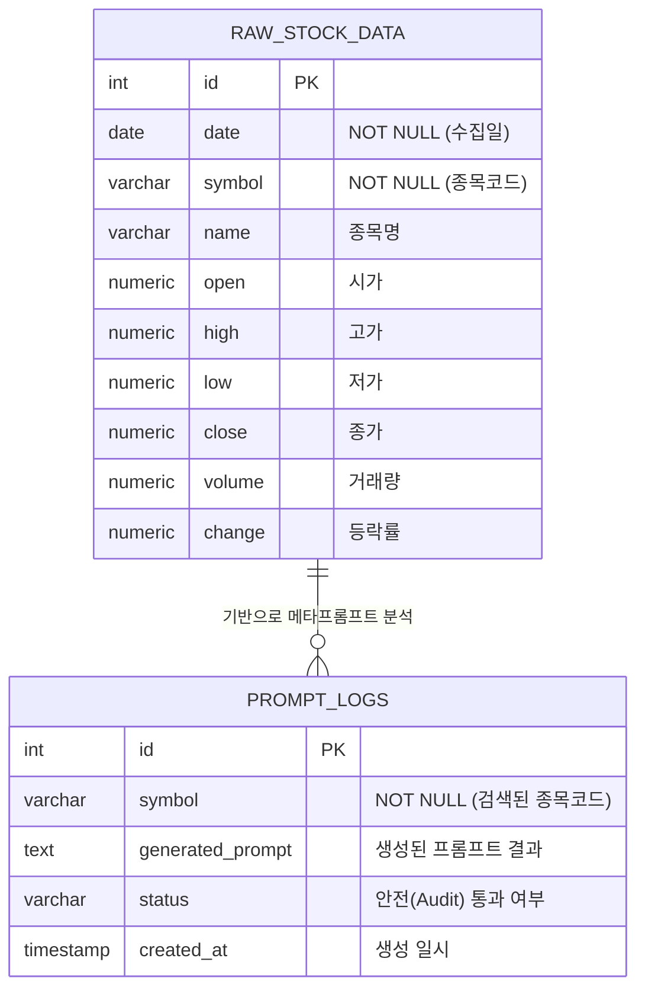

# 🏗️ Docker Compose 및 웹 서비스 아키텍처

Ggeolmu 주식 검색 웹사이트는 도커 데이터베이스 컨테이너와 로컬 FastAPI 웹 서버의 2-Tier 구조로 단순화되었습니다.

### 💡 작동 흐름 설명

1. **데이터베이스 분리 (`docker compose up -d`)**:
   - PostgreSQL 데이터베이스만 Docker 컨테이너 상에서 독립적으로 가동시킵니다.
   - 컨테이너 내부의 데이터베이스 정보는 휘발되지 않도록 호스트 컴퓨터의 `./Data/pgdata` 폴더와 영구적으로 동기화(Mount)됩니다.
2. **FastAPI 웹 서버 구동**:
   - `Parser/was_app/app.py`를 가상환경에서 실행하면 내장된 Uvicorn 서버가 `8000`번 포트에서 요청을 처리하기 시작합니다.
   - FastAPI는 `/api/*` 경로를 제외한 모든 자원에 대해 `web_static/index.html`을 서빙하여 **프론트엔드 중심 라우팅(SPA)**을 구현합니다.
3. **로컬 파이프라인 구동**:
   - 주가 갱신 및 가공이 필요할 시 `python Parser/main.py`를 수동이나 스케줄러를 통해 실행하며, 수집된 결과는 `db_manager`를 통해 데이터베이스에 반영됩니다.

---

## 🗄️ 개체 관계도 (ER Diagram)

현재 PostgreSQL에 구축되는 핵심 테이블 구조 및 논리적 연관성입니다. 수집된 원시 데이터와 에이전트가 생성한 프롬프트 로그가 어떻게 관리되는지 보여줍니다.

### 💡 데이터 테이블 설명
- **`RAW_STOCK_DATA`**: `main.py`의 Dask 기반 수집기가 매일 시장 마감 후 원시 주가 데이터를 UPSERT(Date+Symbol 충돌 시 업데이트) 방식으로 쌓는 테이블입니다. 
- **`PROMPT_LOGS`**: 사용자가 웹(WEB)에서 종목을 검색했을 때, 에이전트(AuditAgent & PromptMakerAgent)가 동작한 이력과 생성된 최종 프롬프트 문구를 저장하는 로그 테이블입니다. 두 테이블은 논리적으로 `symbol`(종목코드) 필드를 통해 연결됩니다.
