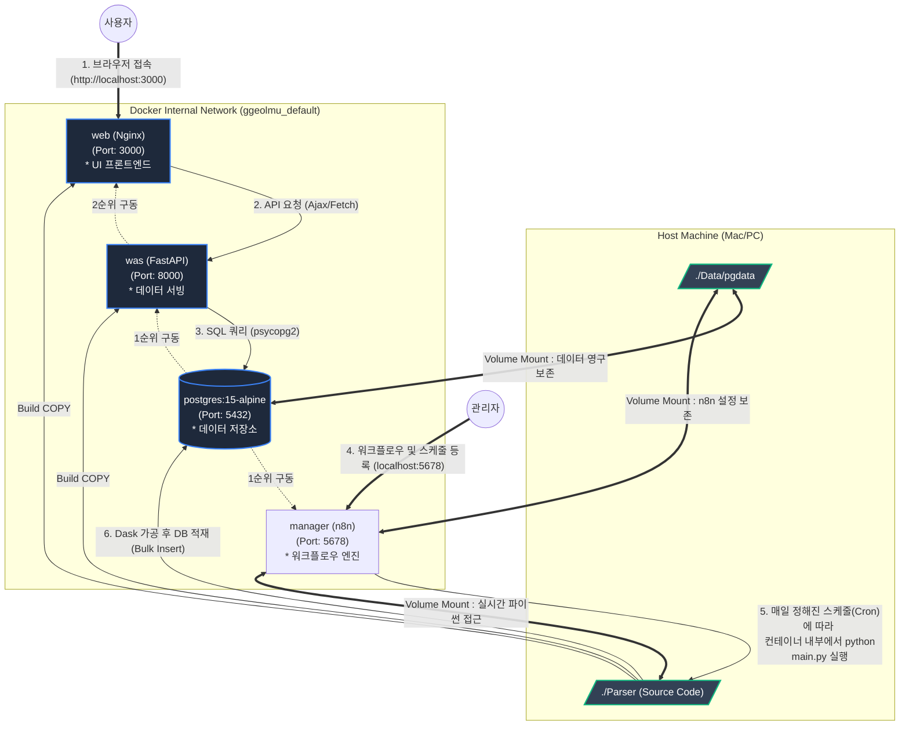
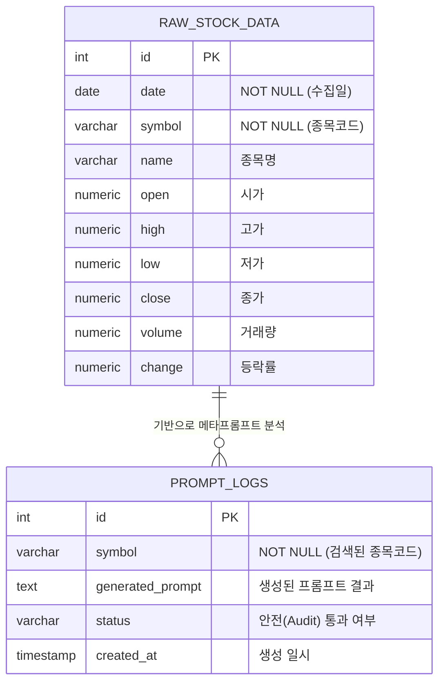
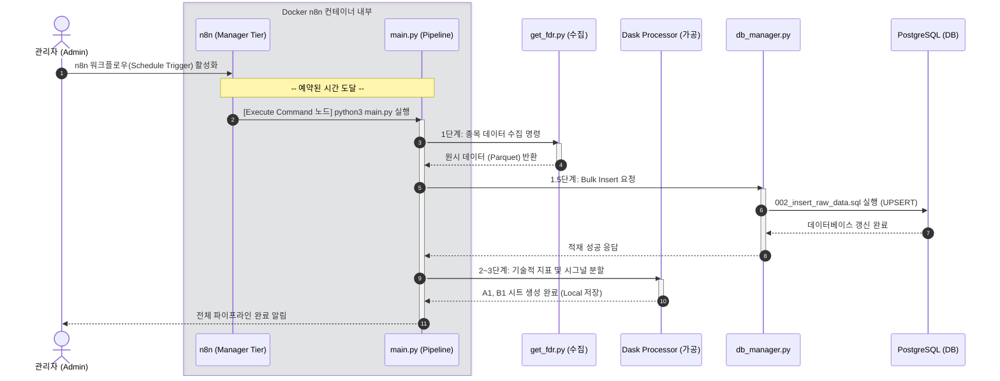

# 🤖 Ggeolmu Multi-Agent Stock Parser & Analyzer

## 1. 개요
`Ggeolmu Parser` 모듈은 국내(KOSPI, KOSDAQ) 및 해외(NASDAQ, NYSE) 주식 데이터를 수집하고 가공하여 **PostgreSQL 데이터베이스에 적재**하는 자동화 파이프라인입니다. 
추가적으로, 적재된 시계열 데이터를 바탕으로 LLM 기반 분석 프롬프트를 자동으로 생성해 내는 **멀티 에이전트(Multi-Agent) 시스템**과 **웹(Web) 프론트엔드**를 통합 제공합니다.

## 2. 시스템 아키텍처 및 도커 환경

시스템은 4-Tier 아키텍처(WEB, WAS, DB, Manager) 구조를 따르며, `docker compose up -d --build` 명령어를 통해 손쉽게 로컬에서 전체 환경을 기동할 수 있습니다.



### 2.1 개체 관계도 (ER Diagram)

시스템 내 데이터베이스(PostgreSQL)의 주요 테이블 구조와 논리적 관계입니다.



## 3. 파이프라인 단계 및 모듈 역할

### 3.1. 데이터 수집 및 DB 적재 파이프라인 (`main.py`)
파이프라인 관리 모듈은 로컬 `DBManager`를 통해 PostgreSQL 데이터베이스에 데이터를 직접 적재합니다.
- **`get_fdr.py`**: FinanceDataReader 기반 초기 데이터 크롤링 수행
- **`process_a1.py`, `process_b1.py`**: Dask 기반 시그널 데이터 및 기술적 지표 시트 분할 생성
- **`db_manager.py`**: 파이프라인 1.5단계에서 `insert_raw_data` 쿼리 스크립트를 사용하여 수집된 Raw 데이터를 PostgreSQL로 Bulk Insert 함
- **`queries/` 디렉토리**: SQL 인젝션 공격 방지를 위해 쿼리를 독립된 파일(`001_`, `002_`, `003_`)로 분리 관리

#### 📊 파이프라인 데이터 흐름 시퀀스
아래는 n8n 스케줄러가 정해진 시간에 파이프라인을 자동 트리거했을 때, 데이터가 어떻게 수집되고 가공되어 최종적으로 데이터베이스에 들어가는지를 보여줍니다.



### 3.2. 멀티 에이전트 시스템 (`agents/`)
사용자가 웹사이트에서 종목을 검색하면, 두 에이전트가 협업하여 작동합니다.
- **`AuditAgent` (`audit_agent.py`)**: 검색된 종목이 스팩(SPAC), ETF, 채권 등 불필요한 종목인지 실시간으로 검열합니다. 또한 생성된 프롬프트나 쿼리에 SQL 템플릿 주입 등의 보안 위협이 없는지 감시합니다.
- **`PromptMakerAgent` (`prompt_maker_agent.py`)**: 검색된 종목의 최근 5일치 시계열 데이터를 PostgreSQL에서 가져온 뒤, LLM이 즉시 퀀트 분석을 시작할 수 있도록 컨텍스트가 부여된 메타 프롬프트를 자동으로 조립합니다.

## 4. 실행 방법

1. **Docker 컨테이너 동시 실행 (DB + API + WEB + Manager)**
   ```bash
   # 프로젝트 최상단 디렉토리에서 실행
   docker compose up -d --build
   ```
   이후 `http://localhost:3000` 으로 접속하면 종목 검색용 웹 화면이 나타납니다.

2. **자동 스케줄러(n8n) 접속 및 파이프라인 활성화**
   - 브라우저에서 `http://localhost:5678` 로 접속합니다.
   - n8n 워크플로우에 `Execute Command` 노드를 추가하고 `cd /app/Parser && python3 main.py`를 실행하도록 설정합니다. (또는 제공된 `n8n_workflow_template.json`을 Import)
   - 스케줄 트리거를 설정해두면 관리자 개입 없이 매일 데이터가 백그라운드에서 적재됩니다.
