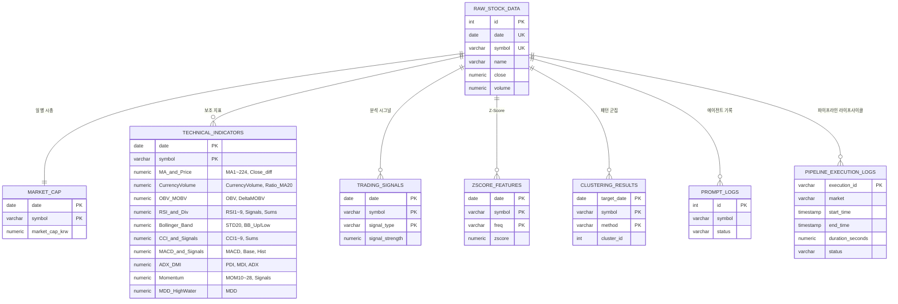
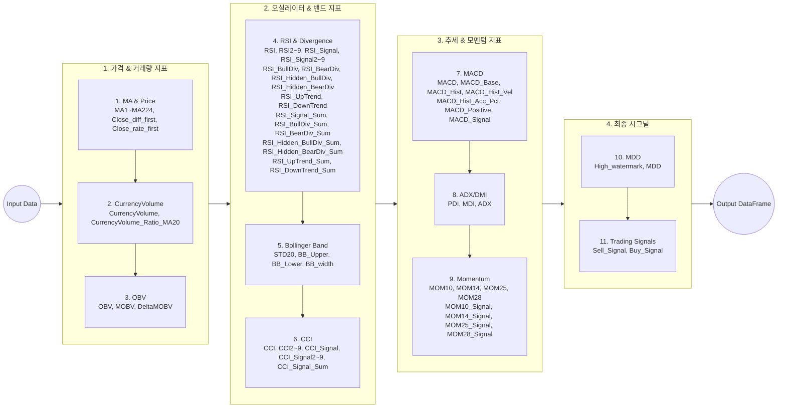

# 🤖 Ggeolmu Multi-Agent Stock Parser & Analyzer

## 1. 개요
`Ggeolmu` 프로젝트는 국내(KOSPI, KOSDAQ) 및 해외(NASDAQ, NYSE) 주식 데이터를 수집·가공하여 **로컬 파일(CSV/Parquet) 생성 없이 100% PostgreSQL 데이터베이스에만 적재**하고, 이를 멀티 에이전트(Multi-Agent) 기반으로 분석하여 시각화하는 **4-Tier (WEB-WAS-DB-Manager) 주식 분석 웹 서비스**입니다.

macOS 환경에 맞춘 시스템 파일 디스크립터 상향(`ulimit -n 65,536`), **파이프라인 모니터링 대시보드 (`/pipeline`)**, **검색종목 유연 매핑(Symbol ➡ 종목명)**, **`get_dynamic_cluster_config()` 동적 자원 자동 감지 모듈**, **`Database/queries/` 16개 SQL 다중 자동 로딩**, **100% Serverless DB Architecture (파일 I/O 찌꺼기 완벽 제거)**, **yfinance 기반 다중 스레드 초고속 미국 마켓 일괄 수집**, 그리고 **SoftDTW 클러스터링 다중 코어 개방(`n_jobs=-1`)** 구조를 적용하여 최신 주가 및 기술적 지표를 안전하고 극단적으로 빠르게 갱신합니다.

---

## 2. 시스템 아키텍처 및 파이프라인 (System Architecture)

### 2.1 전체 데이터 파이프라인 흐름도 (Data Pipeline Architecture)

```mermaid
flowchart TD
    %% 수직 순차 흐름 및 큼직한 폰트(16px, bold) 스타일 정의
    classDef pythonEngine fill:#1e3a8a,stroke:#60a5fa,stroke-width:2.5px,color:#ffffff,font-size:16px,font-weight:bold;
    classDef dbStorage fill:#064e3b,stroke:#34d399,stroke-width:2.5px,color:#ffffff,font-size:16px,font-weight:bold;
    classDef agentManager fill:#831843,stroke:#f472b6,stroke-width:2.5px,color:#ffffff,font-size:16px,font-weight:bold;
    classDef webServer fill:#1e293b,stroke:#94a3b8,stroke-width:2.5px,color:#ffffff,font-size:15px,font-weight:bold;
    classDef logicNode fill:#d97706,stroke:#fcd34d,stroke-width:2.5px,color:#ffffff,font-size:15px,font-weight:bold;

    %% 1단계: DB 중심 지능형 증분 수집 (Smart Ingestion)
    subgraph Step1 ["1단계: DB 중심 지능형 증분 수집 (No Local Files)"]
        direction TB
        DB_Check{"기존 데이터 MAX Date 확인"}:::logicNode
        
        DB_Check -->|한국/미국 마켓 수집| DeltaFetch["⚡ yfinance Multi-thread (미국)<br>fdr.StockListing (한국)<br>초고속 증분 수집 (메모리 로드)"]:::pythonEngine
        
        DB_Raw[("💾 DB: raw_stock_data<br>(로컬 파일 찌꺼기 없음)")]:::dbStorage
        DeltaFetch -->|안전한 Upsert (DB 직결)| DB_Raw
    end

    %% 2단계: 기술적 지표 및 시그널 연산
    subgraph Step2 ["2단계: 지표 가공 & 시그널 생성 (Dynamic RAM Control)"]
        direction TB
        ProcessA1["🐍 process_a1.py<br>(Dynamic RAM Control / MA,RSI,MACD,Sell_Signal)"]:::pythonEngine
        ProcessA1 -->|지표 덮어쓰기 Upsert| DB_Tech[("💾 DB: technical_indicators")]:::dbStorage
        ProcessA1 -->|시그널 직행 저장| DB_Signal[("💾 DB: trading_signals")]:::dbStorage
        ProcessA1 -->|지표 릴레이| ProcessB3["🐍 process_b3.py<br>(상승/하락/다이버전스 시계열 집계)"]:::pythonEngine
    end

    %% 3단계: 시계열 클러스터링
    subgraph Step3 ["3단계: 멀티 코어 클러스터링 (Full CPU Unlock)"]
        direction TB
        ProcessM1["🐍 process_m1_cap.py<br>(시가총액 데이터 가공)"]:::pythonEngine -->|시총 직행 적재| DB_Cap[("💾 DB: market_cap")]:::dbStorage
        ProcessM1 -->|정규화| ProcessC1["🐍 process_c1.py<br>(1d/1w/1m Z-Score 산출)"]:::pythonEngine
        ProcessC1 -->|Z_Score 직행 적재| DB_ZScore[("💾 DB: zscore_features")]:::dbStorage
        ProcessC1 -->|n_jobs=-1 100% 점유| ProcessC2["🐍 process_c2.py<br>(SoftDTW 다중 스레드 군집화)"]:::pythonEngine
        ProcessC2 -->|군집 결과 최신화| DB_Cluster[("💾 DB: clustering_results")]:::dbStorage
    end

    %% 4단계: 4-Tier 웹 서비스 & 멀티 에이전트
    subgraph Step4 ["4단계: 4-Tier 웹 서비스 & Multi-Agent"]
        direction TB
        UI[/"🖥️ WEB: Vanilla JS SPA UI<br>(/pipeline 및 5개 관제 페이지 UI/UX 개편)"/]:::webServer <--> WAS["⚙️ WAS: FastAPI Server"]:::webServer
        
        %% Redis Cache Layer 명시
        WAS -.->|1. 인메모리 캐시 조회 Hit or Miss| RedisCache[("⚡ Redis Cache<br>(대시보드 API 250배 성능 개선)")]:::dbStorage
        RedisCache -.->|2. 캐시 데이터 즉시 반환| WAS
        
        WAS <--> Audit["🤖 Manager: AuditAgent<br>(SPAC/ETF 필터 & SQLi 검사)"]:::agentManager
        WAS <--> PromptAgent["🤖 Manager: PromptMakerAgent<br>(5일 시세/지표 퀀트분석)"]:::agentManager
        WAS -->|프롬프트 기록| DB_Logs[("💾 DB: prompt_logs")]:::dbStorage
        
        PipeAgent["🤖 Manager: PipelineLifecycleAgent<br>(상태, 에러 로그 모니터링)"]:::agentManager -->|라이프사이클 기록| DB_PipeLogs[("💾 DB: pipeline_execution_logs")]:::dbStorage
        SecAgent["🤖 Manager: WebSecurityAgent<br>(WEB-WAS-DB 취약점 탐지)"]:::agentManager -.- WAS
    end

    %% [위에서 아래로 이어지는 수직 메인 데이터 흐름선]
    Step1 == 1. raw_stock_data 공급 ==> Step2
    Step1 == 2. raw_stock_data 공급 ==> Step3
    Step2 == 3. 분석 지표 및 시그널 공급 ==> Step4
    Step3 == 4. 군집 공급 ==> Step4
```

---

### 2.2 개체 관계도 (ER Diagram)

PostgreSQL 데이터베이스 8개 핵심 테이블 간의 수직 방사형 연관 관계입니다.



---

### 2.3 `calculate_indicators` 지표 연산 흐름도 (Process A1)

기술적 지표 계산 및 유동성 사냥(조작) 패턴 필터링의 단계별 수행 과정을 나타냅니다.



---

## 3. 4-Tier 아키텍처 구성 및 역할

- **WEB Tier (`Web/`)**: Vanilla JS 및 CSS Glassmorphism 기반 SPA. 반응형 상대 크기 조절 레이아웃 적용 (5개관제 페이지 UI/UX 개편 및 네비게이션 헤더 메뉴 통합).
- **WAS Tier (`WAS/app.py`)**: FastAPI 기반 비동기 REST API 서빙 (`GET /api/pipeline/logs`, `GET /api/analytics` 종목명 유연 매핑) 및 정적 웹 리소스 제공.
- **DB Tier (`Database/`)**: PostgreSQL DBMS. `Database/queries/` 수록 `001_`~`016_` SQL 쿼리 중앙 통합 관리 (SQL Injection 방지).
- **Manager Tier (`Manager/`)**:
  - `PipelineLifecycleAgent`: 파이프라인 실행 시작/끝 시간, 소요시간(초), 세부 단계 상태, 에러 로그 모니터링 관리.
  - `AuditAgent`: 불필요 종목(ETF/SPAC) 필터링 및 프롬프트 주입/SQLi 검사.
  - `PromptMakerAgent`: 5일 주가 흐름 기반 퀀트 메타 프롬프트 일괄 생성.
  - `WebSecurityAgent`: WEB-WAS-DB 계층 취약점 탐지 및 보안 관리.

---

## 3.5 데이터 파이프라인 신뢰성 및 장애 복구 (Reliability & Fault Tolerance)
데이터의 무결성과 파이프라인의 안정성을 보장하기 위해 다음과 같은 아키텍처가 적용되어 있습니다.

1. **지능형 증분 수집 및 폴백 (Intelligent Fallback)**
   - **빈 DB 방어 로직**: 데이터베이스 초기화 시 `MAX(date)` 탐지 실패를 감지하면 즉시 2000년(24년치)부터 풀 데이터를 수집하는 모드로 자동 전환됩니다 (초기 약 20분 소요).
   - **초고속 증분 수집**: 풀 데이터가 확보된 후에는 매일 0.5초 이내에 새롭게 갱신된 시세만 안전하게 병합(`fdr.StockListing` 기반)합니다.
2. **동적 자원 할당 (Dynamic Resource Allocation)**
   - `get_dynamic_cluster_config()`를 통해 서버의 RAM과 CPU 코어를 자동 감지하여 Dask 워커 개수와 메모리 임계치(`target: 70%`, `spill: 85%`)를 동적 조정합니다. 대규모 지표 연산 시 발생하는 OOM(Out Of Memory) 킬 현상을 원천 차단합니다.
3. **무중단 스키마 마이그레이션 (Schema Resilience)**
   - `technical_indicators` 및 `trading_signals`와 같은 파생 데이터 테이블은 구조가 변경되더라도 `raw_stock_data`를 기반으로 100% 자동 재계산이 가능합니다. 컬럼 추가 시 기존 테이블을 `DROP`하기만 하면 다음 파이프라인 주기에서 완벽한 새 구조로 복구(Reconstruct)됩니다.
4. **안전한 DB 병합 (PostgreSQL ON CONFLICT Upsert)**
   - 데이터를 적재할 때 단순 `INSERT`가 아닌 `ON CONFLICT (date, symbol) DO UPDATE` 패턴을 적용하여, 중복 실행이나 과거 데이터 재수집 시에도 무결성을 100% 보장하며 데이터 꼬임(Duplicate Key Error)을 방지합니다.
5. **트랜잭션 안전성을 위한 일괄 적재 (Bulk Insert Architecture)**
   - **부분 업데이트 방지**: 수집 도중 중간중간 DB에 기록할 경우, 예기치 않은 중단 시 DB가 부분적으로 오염되어 다음 증분 탐지(`MAX(date)`) 로직이 붕괴될 위험이 있습니다.
   - **All-or-Nothing 보장**: 이를 방지하기 위해 Dask가 100% 수집을 완료한 거대한 데이터(약 1,400만 행)를 한 번의 트랜잭션으로 밀어 넣는 방식을 채택했습니다. 이는 2,463번의 잦은 쓰기 락(Lock)을 방지하고 파이프라인의 데이터 신뢰도를 극대화합니다.

---

## 4. 실행 방법

### 1) PostgreSQL DB 구동
```bash
docker compose up -d
```

### 2) 웹/WAS 애플리케이션 실행
```bash
python WAS/app.py
```
접속 URL: `http://localhost:8000` (파이프라인 관제: `http://localhost:8000/pipeline`)

### 3) 데이터 증분 수집 파이프라인 실행
```bash
python Parser/main.py
```


