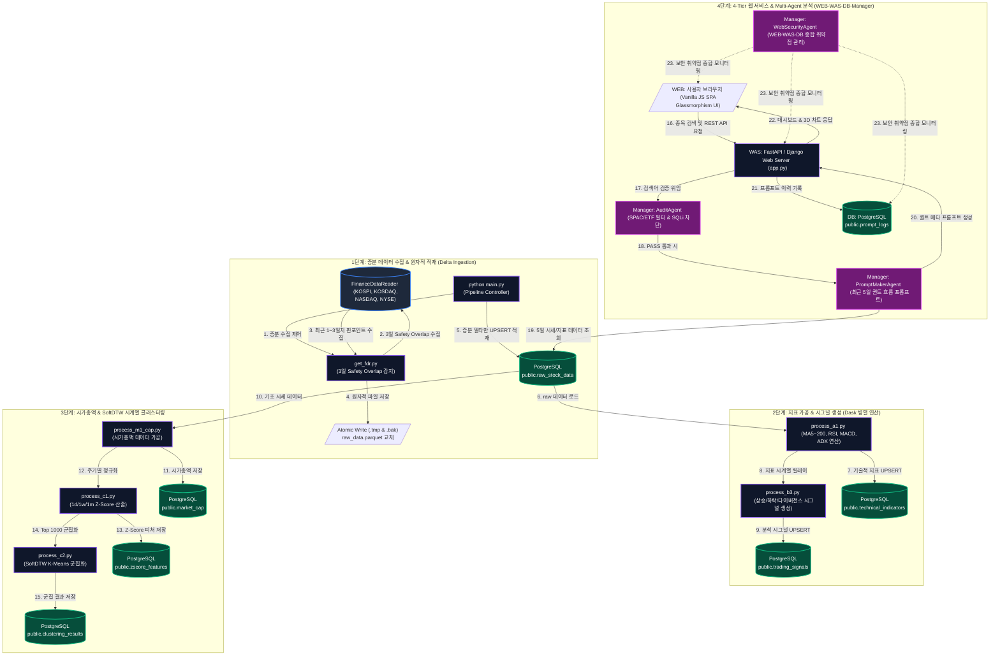
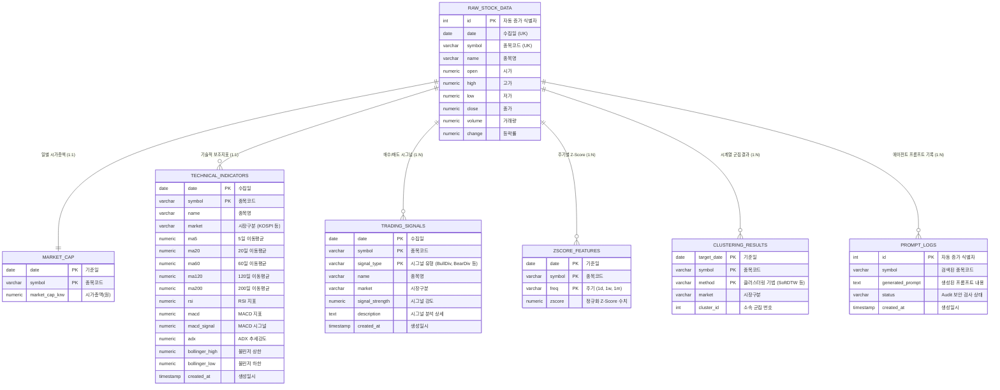

# 🤖 Ggeolmu Multi-Agent Stock Parser & Analyzer

## 1. 개요
`Ggeolmu` 프로젝트는 국내(KOSPI, KOSDAQ) 및 해외(NASDAQ, NYSE) 주식 데이터를 수집하고 가공하여 **PostgreSQL 데이터베이스에 적재**하고, 이를 시각화하여 멀티 에이전트(Multi-Agent) 기반의 맞춤형 분석 프롬프트를 조회할 수 있는 **4-Tier (WEB-WAS-DB-Manager) 주식 분석 웹 서비스**입니다.

n8n과 같은 무거운 스케줄러 관리 툴 없이, 로컬 Python 환경 및 Dask 분산 컴퓨팅 기반의 **안정성 강화 증분 수집(Delta Ingestion)** 파이프라인을 구축하여 최신 데이터를 수 초 내로 갱신 및 분석합니다.

---

## 2. 시스템 아키텍처 및 파이프라인 (System Architecture)

### 2.1 전체 데이터 파이프라인 흐름도 (Mermaid Pipeline Flowchart)



---

### 2.2 개체 관계도 (ER Diagram)

PostgreSQL 데이터베이스의 7개 핵심 테이블 스키마 구조와 테이블 간 릴레이션 관계입니다.



---

## 3. 4-Tier 아키텍처 및 모듈 구성

프로젝트는 Cloud 및 On-premise 환경 배포를 고려하여 **4-Tier (WEB - WAS - DB - Manager)** 독립 계층 구조로 설계되었습니다.

### 3.1. 계층별 구성 (4-Tier Architecture)
- **WEB (Static Frontend)**: `Web/` 디렉토리에 위치. Vanilla JS 및 Glassmorphism CSS 디자인 시스템 기반의 SPA 레이아웃. 브라우저 크기 변경 시 상대적 비율을 유지하도록 다이내믹 포맷 구현.
- **WAS (Web Application Server)**: `WAS/app.py` 또는 `Parser/was_app/app.py`. FastAPI 기반 REST API 엔드포인트 제공 및 정적 파일 서빙.
- **DB (Database Storage)**: PostgreSQL RDBMS. SQL Injection 방지를 위하여 `Database/queries/`에 `001_`~`014_` 접두어 스크립트로 쿼리를 안전하게 일원화 및 분리 관리.
- **Manager (AIOps & Multi-Agent & Security)**:
  - **`AuditAgent` (`audit_agent.py`)**: 불필요한 ETF, SPAC 종목 1차 필터링 및 프롬프트 주입/SQLi 공격 검증.
  - **`PromptMakerAgent` (`prompt_maker_agent.py`)**: 최근 5일 시세/지표 기반 퀀트 메타 프롬프트 생성 및 라이프사이클 관리.
  - **`WebSecurityAgent` (`web_security_agent.py`)**: WEB, WAS, DB의 종합적인 취약점 탐지 및 탐구 모니터링 관리.

---

## 4. 실행 방법

### 1) PostgreSQL 데이터베이스 실행
프로젝트 최상단 디렉토리에서 실행하여 DB 컨테이너를 구동합니다.
```bash
docker compose up -d
```

### 2) 웹 애플리케이션 및 API 서버 구동
FastAPI 애플리케이션을 구동하여 정적 파일 서빙과 API 연동을 시작합니다.
```bash
python WAS/app.py
```
서버 구동 후 브라우저에서 `http://localhost:8000`으로 접속하여 주식 검색 및 3D 클러스터링 웹 서비스(SPA)를 이용하실 수 있습니다.

### 3) 데이터 증분 수집 및 갱신 파이프라인 실행 (수동/스케줄러)
새로운 주식 데이터를 3일 오버랩 핀포인트 증분 수집(Delta Ingestion)하고 원자적으로 적재하려면 아래 파이프라인 명령을 실행합니다.
```bash
python Parser/main.py
```
*(매일 장 마감 후 주기적으로 실행되도록 OS의 Cron이나 작업 스케줄러에 등록하여 자동화할 수 있습니다.)*
