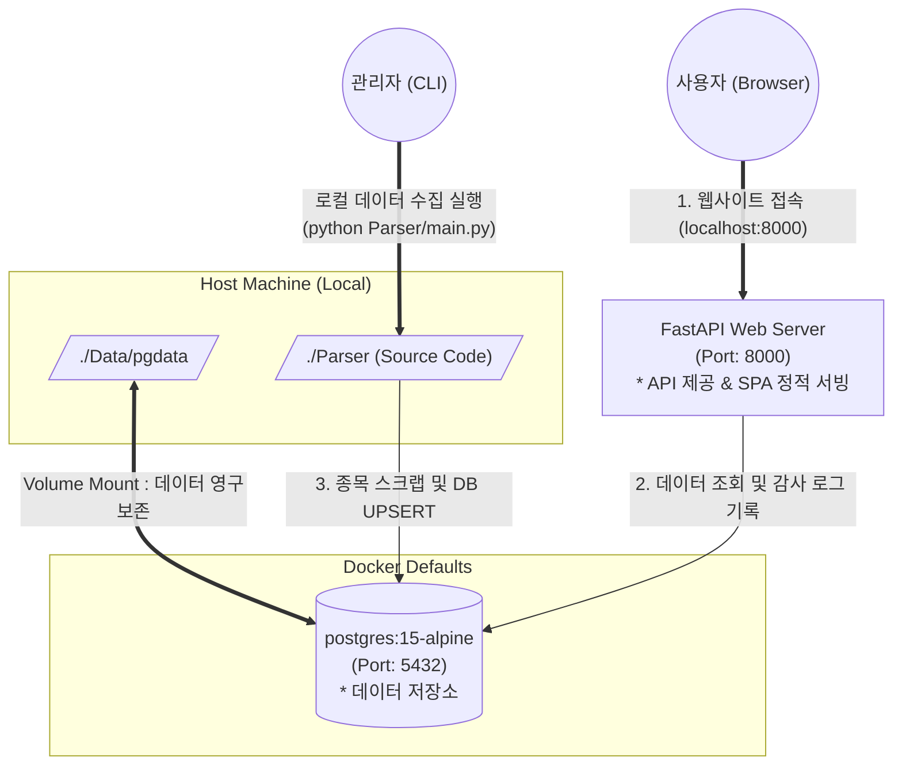
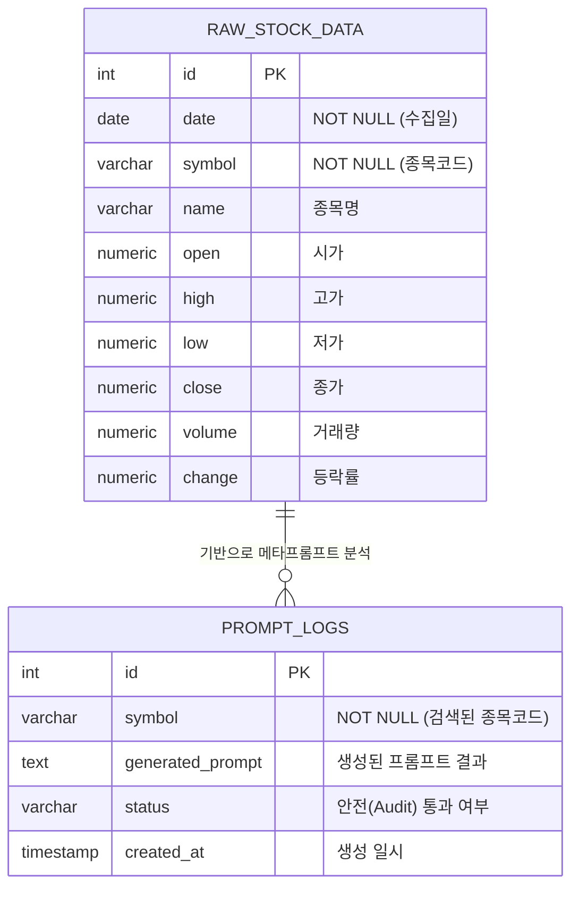

# 🤖 Ggeolmu Multi-Agent Stock Parser & Analyzer

## 1. 개요
`Ggeolmu` 프로젝트는 국내(KOSPI, KOSDAQ) 및 해외(NASDAQ, NYSE) 주식 데이터를 수집하고 가공하여 **PostgreSQL 데이터베이스에 적재**하고, 이를 시각화하여 멀티 에이전트(Multi-Agent) 기반의 맞춤형 분석 프롬프트를 조회할 수 있는 **주식 검색 Single Page Application (SPA) 웹 서비스**입니다.

n8n과 같은 무거운 스케줄러 관리 툴 없이, 로컬 Python 환경 및 Docker 기반 데이터베이스와 FastAPI 단독 서비스로 결합하여 최적화된 구동 방식을 지원합니다.

---

## 2. 시스템 아키텍처 및 데이터 흐름

시스템은 데이터 보존용 DB 컨테이너와 정적 웹 UI 및 API 서버 역할을 병행하는 FastAPI WAS 서버의 2-Tier 구조를 따릅니다.



### 2.1 개체 관계도 (ER Diagram)

데이터베이스(PostgreSQL)의 주요 테이블 구조와 관계입니다.



---

## 3. 파이프라인 단계 및 모듈 역할

### 3.1. 데이터 수집 및 DB 적재 파이프라인 (`main.py`)
- **`get_fdr.py`**: FinanceDataReader 기반 초기 데이터 크롤링 수행
- **`process_a1.py`, `process_b1.py`**: Dask 기반 시그널 데이터 및 기술적 지표 시트 분할 생성
- **`db_manager.py`**: 파이프라인 진행 및 DB 연결을 제어하며 `insert_raw_data` 및 `write_query` 메소드를 통해 데이터베이스 갱신
- **`queries/` 디렉토리**: SQL 인젝션 공격 방지를 위해 쿼리를 독립된 파일(`001_` ~ `004_`)로 분리 관리

### 3.2. 보안 및 프롬프트 에이전트 (`agents/`)
- **`AuditAgent` (`audit_agent.py`)**: 스팩(SPAC), ETF 등 불필요한 종목을 필터링하고, 잠재적인 SQL 인젝션 및 프롬프트 주입 공격을 사전 검증.
- **`PromptMakerAgent` (`prompt_maker_agent.py`)**: 최근 5일 데이터 흐름을 추적하여 퀀트 관점에서 최적화된 프롬프트 생성.

---

## 4. 실행 방법

### 1) PostgreSQL 데이터베이스 실행
프로젝트 최상단 디렉토리에서 실행하여 DB 컨테이너를 구동합니다.
```bash
docker compose up -d
```

### 2) 웹 애플리케이션 및 API 서버 구동
FastAPI 애플리케이션을 구동하여 정적 파일 서빙과 API 연동을 시작합니다.
```bash
python Parser/was_app/app.py
```
서버 구동 후 브라우저에서 `http://localhost:8000`으로 접속하여 주식 검색 웹 서비스(SPA)를 이용하실 수 있습니다.

### 3) 데이터 수집 및 갱신 파이프라인 실행 (수동/스케줄러)
새로운 주식 데이터를 수집하고 적재하려면 아래 파이프라인 명령을 실행합니다.
```bash
python Parser/main.py
```
*(매일 마감 후 주기적으로 실행되도록 OS의 Cron이나 작업 스케줄러에 등록하여 자동화할 수 있습니다.)*
