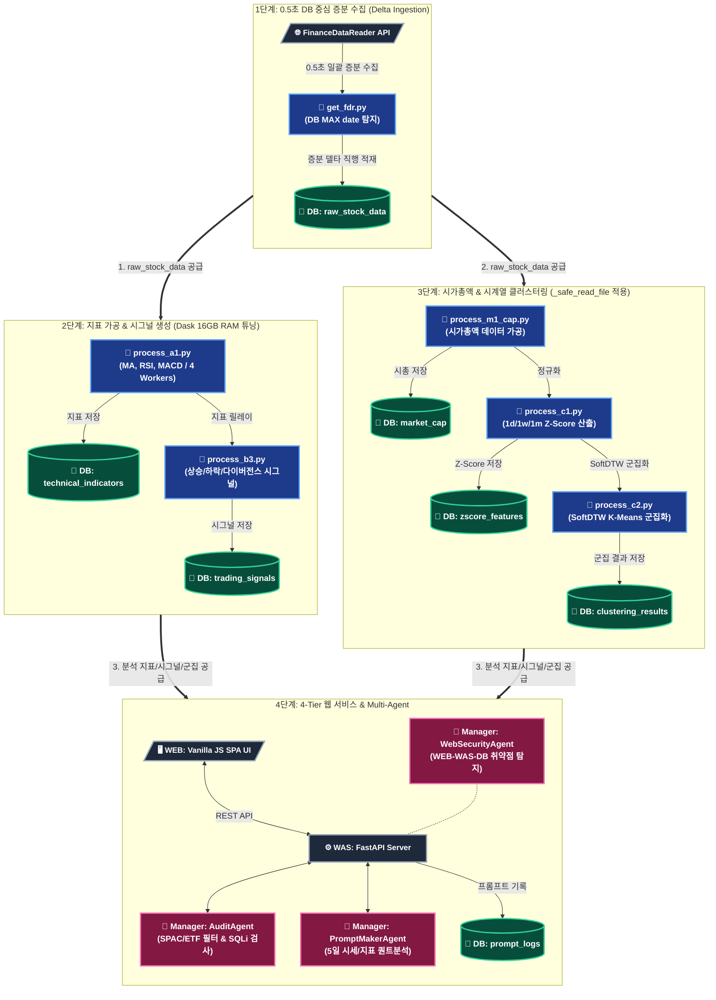
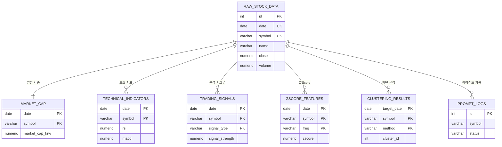

# 🤖 Ggeolmu Multi-Agent Stock Parser & Analyzer

## 1. 개요
`Ggeolmu` 프로젝트는 국내(KOSPI, KOSDAQ) 및 해외(NASDAQ, NYSE) 주식 데이터를 수집·가공하여 **PostgreSQL 데이터베이스에 적재**하고, 이를 멀티 에이전트(Multi-Agent) 기반으로 분석하여 시각화하는 **4-Tier (WEB-WAS-DB-Manager) 주식 분석 웹 서비스**입니다.

macOS 환경에 맞춘 시스템 파일 디스크립터 상향(`ulimit -n 65,536`), **`_safe_read_file` 범용 파일 호환 로더** 및 **`fdr.StockListing` 기반 0.5초 초고속 DB 직행 증분 수집(DB-Centric Bulk Ingestion)** 구조를 적용하여 최신 주가 및 기술적 지표를 안전하고 빠르게 갱신합니다.

---

## 2. 시스템 아키텍처 및 파이프라인 (System Architecture)

### 2.1 전체 데이터 파이프라인 흐름도 (Data Pipeline Architecture)



---

### 2.2 개체 관계도 (ER Diagram)

PostgreSQL 데이터베이스 7개 핵심 테이블 간의 수직 방사형 연관 관계입니다.



---

## 3. 4-Tier 아키텍처 구성 및 역할

- **WEB Tier (`Web/`)**: Vanilla JS 및 CSS Glassmorphism 기반 SPA. 반응형 상대 크기 조절 레이아웃 적용.
- **WAS Tier (`WAS/app.py`)**: FastAPI 기반 비동기 REST API 서빙 및 정적 웹 리소스 제공.
- **DB Tier (`Database/`)**: PostgreSQL DBMS. `queries/001_`~`014_` 수록 SQL 파일로 쿼리 중앙 관리 (SQL Injection 방지).
- **Manager Tier (`Manager/`)**:
  - `AuditAgent`: 불필요 종목(ETF/SPAC) 필터링 및 프롬프트 주입/SQLi 검사.
  - `PromptMakerAgent`: 5일 주가 흐름 기반 퀀트 메타 프롬프트 일괄 생성.
  - `WebSecurityAgent`: WEB-WAS-DB 계층 취약점 탐지 및 보안 관리.

---

## 4. 실행 방법

### 1) PostgreSQL DB 구동
```bash
docker compose up -d
```

### 2) 웹/WAS 애플리케이션 실행
```bash
python WAS/app.py
```
접속 URL: `http://localhost:8000`

### 3) 데이터 증분 수집 파이프라인 실행
```bash
python Parser/main.py
```
